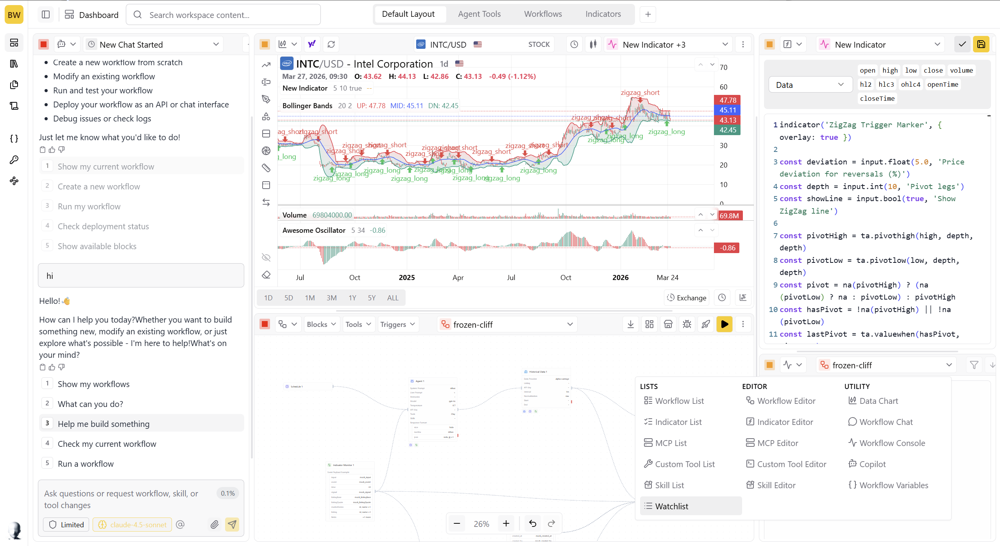

<div align="center">

<h1 align="center">TradingGoose Studio</h1>

[](https://discord.gg/wavf5JWhuT)

An AI workflow platform for technical + LLM trading built for analytics, research, charting, monitoring, and workflow automation.

Start with the [TradingGoose Studio repository](https://github.com/TradingGoose/TradingGoose-Studio) and the [quick start guide](https://github.com/TradingGoose/TradingGoose-Studio/blob/main/README.md#quick-start). The original TradingGoose project documentation is preserved further down in this README.
</div>



## 📑 Table of Contents

- [TradingGoose Studio](#tradinggoose-studio)
- [TradingGoose Original](#tradinggoose-original)
- [📖 Overview](#-overview)
  - [🎯 Core Concept](#-core-concept)
  - [🔄 Intelligent Execution](#-intelligent-execution)
  - [🏗️ Architecture Foundation](#️-architecture-foundation)
- [✨ Features](#-features)
  - [🤖 Multi-Agent Architecture](#-multi-agent-architecture)
  - [📊 Core Capabilities](#-core-capabilities)
  - [🔐 Security & Access Control](#-security--access-control)
- [🛠️ Tech Stack](#️-tech-stack)
  - [🎨 Frontend](#-frontend)
  - [⚙️ Backend](#️-backend)
  - [📈 Trading Integration](#-trading-integration)
- [🔄 How It Works](#-how-it-works)
  - [🔬 The Analysis Process](#-the-analysis-process)
- [🚀 Usage](#-usage)
  - [🧪 Running an Analysis](#-running-an-analysis)
  - [💼 Portfolio Rebalancing](#-portfolio-rebalancing)
- [🔒 Security Considerations](#-security-considerations)
- [📄 License](#-license)
- [💬 Support](#-support)
- [🚀 Self Deployment](#-self-deployment)
  - [Prerequisites](#prerequisites)
  - [Perplefina Setup](#perplefina-setup)
  - [Backend Setup](#backend-setup)
  - [Frontend Setup](#frontend-setup)
  - [Development Mode](#development-mode)
- [🚧 Development](#-development)
  - [✅ Feature Checklist](#-feature-checklist)
- [🤝 Contributing](#-contributing)
- [🙏 Acknowledgments](#-acknowledgments)

## TradingGoose Studio

If you want to explore the new TradingGoose project, start with [TradingGoose Studio](https://github.com/TradingGoose/TradingGoose-Studio).

<p>
  
</p>

TradingGoose Studio is an AI workflow platform for technical + LLM trading. It is built for:

- Analytics and research workflows
- Charting and live monitoring
- Workflow automation and iteration

Start here:

- Repository: [TradingGoose/TradingGoose-Studio](https://github.com/TradingGoose/TradingGoose-Studio)
- Quick start and setup guide: [TradingGoose Studio README](https://github.com/TradingGoose/TradingGoose-Studio/blob/main/README.md#quick-start)

## TradingGoose Original

<div align="center">

<h1 style="line-height:50px;" align="center"> TradingGoose </h1>

An intelligent trading platform powered by multiple AI agents that collaborate to analyze markets, manage portfolios, and execute trades with sophisticated risk management—now fully open source.
</div>


## 📖 Overview

TradingGoose focuses on **event-driven trading strategy and analysis** that harnesses the power of AI agents and Alpaca's market data to deliver sophisticated trading recommendations and automated portfolio management insights. The system employs a multi-agent workflow architecture where specialized AI agents collaborate to analyze market-moving events in real-time.

### 🎯 Core Concept

The system leverages Large Language Models' natural language processing capabilities to rapidly analyze news, social media, and other textual data sources that often trigger market volatility. By processing these events faster than traditional methods, TradingGoose identifies potential market movements and generates timely trading signals for user-selected stocks.

### 🔄 Intelligent Execution

Once analysis agents provide their recommendations, the **Portfolio Manager AI agent** takes over to:
- Analyze the user's Alpaca account details and current portfolio state
- Consider user-configured position sizing, allocation strategies, and risk tolerance
- Generate final trading orders with precise values and actions for specific tickers
- Make autonomous decisions that may differ from initial recommendations based on actual portfolio constraints and risk management

This two-layer approach ensures that while the analysis agents focus on identifying opportunities, the portfolio manager maintains discipline in execution, potentially overriding recommendations when they conflict with portfolio health, risk limits, or allocation rules.

### 🏗️ Architecture Foundation

This project's multi-agent analysis workflow architecture is based on the [TauricResearch/TradingAgents](https://github.com/TauricResearch/TradingAgents) framework, which pioneered the concept of collaborative AI agents for financial analysis.

## ✨ Features

### 🤖 Multi-Agent Architecture

- **Coordinator Agent**: Orchestrates analysis workflows and manages agent collaboration
- **Market Analyst**: Analyzes market trends and technical indicators
- **Fundamentals Analyst**: Evaluates company financials and valuation metrics
- **News Analyst**: Processes and interprets market news and events
- **Social Media Analyst**: Monitors social sentiment and trending topics
- **Risk Analysts** (Safe/Neutral/Risky): Provide multi-perspective risk assessments
- **Portfolio Manager**: Optimizes portfolio allocation and rebalancing

### 📊 Core Capabilities

- **Real-time Market Analysis**: Continuous monitoring of stocks and market conditions
- **Multi-Stock Analysis**: Analyze multiple stocks simultaneously in a single workflow
- **Portfolio Management**: Comprehensive portfolio optimization with position sizing and allocation strategies
- **Scheduled Rebalancing**: Automated portfolio rebalancing on daily, weekly, or monthly schedules
- **Live Trade Execution**: Real order execution through Alpaca Markets (paper and live trading)
- **Risk Assessment**: Multi-dimensional risk analysis from conservative to aggressive perspectives
- **Workflow Visualization**: Real-time tracking of analysis and decision-making processes
- **Historical Tracking**: Complete audit trail of analyses, trades, and rebalancing activities

### 🔐 Security & Access Control

- **Role-Based Access Control (RBAC)**: Granular permission system with admin, moderator, and user roles
- **Secure Authentication**: Supabase-powered authentication with email verification
- **Invitation System**: Controlled user onboarding through admin-managed invitations
- **API Key Management**: Secure storage and management of trading API credentials

## 🛠️ Tech Stack

### 🎨 Frontend

- **React 18** with TypeScript
- **Vite** for fast development and building
- **TailwindCSS** for styling
- **Shadcn/ui** component library
- **React Router** for navigation
- **Recharts** for data visualization

### ⚙️ Backend

- **Supabase** for database, authentication, and real-time updates
- **Edge Functions** for serverless API endpoints & running workflow in background
- **PostgreSQL** for data persistence
- **Row Level Security (RLS)** for data isolation

### 📈 Trading Integration

- **Alpaca Markets API** for market data and trade execution
- **Customizable AI Providers** for agent intelligence (OpenAI, Anthropic, Google, DeepSeek, and more)

---

<br >

## 🔄 How It Works

### 🔬 The Analysis Process

When you initiate a stock analysis, TradingGoose orchestrates a sophisticated multi-agent workflow:

<p>
  
</p>

###### _Note: This workflow architecture is adapted from the [TauricResearch/TradingAgents](https://github.com/TauricResearch/TradingAgents) framework._

<details>
<summary><strong>1. 📊 Data Analysis Phase</strong></summary>

- **🌍 Macro Analyst**: Government data and economic indicators
- **📈 Market Analyst**: Historical data and technical indicators
- **📰 News Analyst**: Latest news and sentiment analysis
- **💬 Social Media Analyst**: Social platform trends and sentiment
- **💼 Fundamentals Analyst**: Company financials and earnings reports
- **🌡️ Risk Analyst Squad**: Risk-adjusted insights from conservative, balanced, and aggressive perspectives

</details>

<details>
<summary><strong>2. 🧠 Opportunity Synthesis</strong></summary>

- Agents collaborate to refine opportunities
- Opportunities include conviction scores, risk factors, and recommended actions
- Portfolio manager evaluates current allocations

</details>

<details>
<summary><strong>3. 💼 Portfolio Manager Execution</strong></summary>

- Validates proposed trades against portfolio constraints
- Adjusts position sizes for risk and diversification
- Generates final orders prepared for Alpaca execution

</details>

<details>
<summary><strong>4. 🔁 Continuous Monitoring</strong></summary>

- Tracks market changes and agent statuses
- Detects stalled workflows and triggers retries
- Provides real-time progress updates

</details>

## 🚀 Usage

### 🧪 Running an Analysis

1. Navigate to the dashboard and select **Run Analysis**
2. Choose tickers and configure analysis parameters
3. Initiate analysis and monitor live agent collaboration
4. Review generated insights, risk scores, and recommended actions
5. Approve or adjust suggested trades before execution

### 💼 Portfolio Rebalancing

1. Go to **Settings → Rebalancing**
2. Configure rebalancing settings (position sizes, thresholds, frequency)
3. Schedule automatic rebalancing or trigger manually
4. Review proposed changes before execution
5. Track rebalancing history and performance

## 🔒 Security Considerations

- All API keys are stored encrypted in environment variables
- Database access is controlled through Row Level Security
- User actions are authenticated and authorized through RBAC
- Sensitive operations require admin privileges
- All trades can be executed in paper trading mode for testing

## 📄 License

TradingGoose is released under the AGPL-3.0 License. Refer to [LICENSE](LICENSE) for the full terms.

## 💬 Support

For issues, questions, or suggestions:

- Open an issue on GitHub
- Join our [Discord community](https://discord.gg/wavf5JWhuT)

## 🚀 Self Deployment

Bring your own TradingGoose instance online using the following workflow.

### Prerequisites

1. **Supabase CLI** (latest version)
2. **Node.js** 18+
3. **npm** or **pnpm**
4. **Alpaca Markets** account (paper trading is supported)
5. **Perplexica/Perplefina** instance or another compatible LLM orchestration layer

### Perplefina Setup

Perplefina provides the external research layer that TradingGoose relies on for market news and web context. You need a running instance that the Supabase edge functions can reach.

1. **Clone and install Perplefina**
   ```bash
   git clone https://github.com/Trading-Goose/Perplefina.git
   cd Perplefina
   npm install
   ```
2. **Configure providers**
   - Follow the configuration instructions in the [Perplefina repository](https://github.com/Trading-Goose/Perplefina)
   - Add API keys for the AI models you plan to use (OpenAI, Anthropic, Google, DeepSeek, etc.)
   - Configure your preferred web search provider credentials
3. **Deploy Perplefina publicly**
   - Deploy to Railway, Render, Fly.io, or another cloud host and record the public URL
   - Confirm the URL is accessible from the internet—Supabase edge functions cannot reach `localhost`
4. **Record the API endpoint**
   - You will supply this URL when setting Supabase secrets (`PERPLEFINA_API_URL`)

### Backend Setup

1. Install Supabase CLI and authenticate:
   ```bash
   npx supabase login
   ```
2. Link the project to your Supabase instance:
   ```bash
   npx supabase link --project-ref your-project-ref
   ```
3. Set required secrets, including your Perplefina URL:
   ```bash
   npx supabase secrets set PERPLEFINA_API_URL=https://your-public-perplexica-url.com
   ```
4. Deploy the edge functions powering the multi-agent workflow:
   ```bash
   export SUPABASE_ACCESS_TOKEN=your-access-token-here
   ./deploy-functions.sh
   ```

### Frontend Setup

1. Install dependencies:
   ```bash
   npm install
   ```
2. Build the static site:
   ```bash
   npm run build
   ```
3. Serve locally or deploy the `dist` folder to your hosting provider.
   ```bash
   npm run dev    # development server with hot reload
   npm run serve  # preview the built site after running dev
   ```

### Development Mode

For hot reload during development:
```bash
npm run dev
```

The application will be available at `http://localhost:8080` (or the port shown in your terminal).

## 🚧 Development

🎉 **No humans were harmed in the making of this application!**

TradingGoose was crafted with love by **[Claude Code](https://claude.ai/code)**—every line of code, from the sleek UI components to the trading orchestration logic, started life as an AI-generated idea. Now that the project is open source, community contributions keep the goose flying! 🪄

---

<br >

### ✅ Feature Checklist

#### Analysis Features

- [x] Multi-stock concurrent analysis
- [x] Cancel/delete running analysis
- [x] Retry failed analysis from specific failed agent
- [x] Reactivate stale/stuck analysis workflows
- [x] Real-time workflow visualization with progress tracking
- [x] Historical analysis tracking and audit trail

#### Portfolio Management

- [x] Automated scheduled rebalancing (daily/weekly/monthly)
- [x] Manual rebalancing triggers
- [x] Position size configuration (min/max)
- [x] Multi-stock portfolio monitoring

#### Trading Features

- [x] Paper trading mode for testing
- [x] Live trading execution via Alpaca
- [x] Real-time order status tracking
- [x] Position management and monitoring

#### AI Configuration

- [x] Multiple AI provider support (OpenAI, Anthropic/Claude, Google, DeepSeek)
- [x] Custom max tokens configuration per agent
- [x] Provider failover and retry logic
- [x] Model selection flexibility

#### Data & Analysis

- [x] Historical data range selection
- [x] Custom analysis timeframes
- [x] Technical indicator calculations
- [x] Fundamental data integration
- [x] News sentiment analysis
- [x] Social media trend tracking

#### User Management

- [x] User account system
- [x] API key management interface
- [x] User activity tracking
- [x] Secure credential storage

## 🤝 Contributing

We welcome pull requests, feature ideas, and bug reports! To get started:

1. Fork the repository and create a feature branch.
2. Ensure linting/tests pass where applicable.
3. Submit a pull request with clear context about the change.

For larger features, open a discussion or issue first so we can plan together.

## 🙏 Acknowledgments

- Built with [Supabase](https://supabase.com)
- Trading powered by [Alpaca Markets](https://alpaca.markets)
- AI analysis powered by customizable providers (OpenAI, Anthropic, Google, DeepSeek, and more)
- UI components from [shadcn/ui](https://ui.shadcn.com)
- Multi-agent architecture inspired by [TauricResearch/TradingAgents](https://github.com/TauricResearch/TradingAgents)
- **100% developed with [Claude Code](https://claude.ai/code)** 🤖

---

**Important**: Always conduct your own research and consider consulting with a financial advisor before making investment decisions. Past performance does not guarantee future results.
